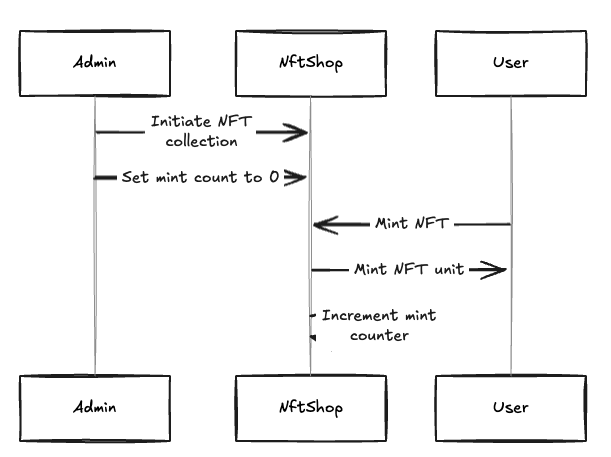

# Turbin3 Pre-Builder Q425

## Capstone Letter of Intent:  Cross-Chain Funding Rate Arbitrage System

### What? The opportunity

- Opportunity: Exploit the 10x latency advantage of Fogo (40ms blocks) over Solana (400ms blocks) combined with funding rate differentials between Drift Protocol (Solana) and Ambient Finance (Fogo) for delta-neutral perpetual futures arbitrage.                                                                                                                                                        
- Note: Assuming this project will represent a capstone, the POC will demonstrate a minimal but complete profitable opportunity between Delta's funding rates. The emphasis of the demo will be on showing the scalability potential of the concept to become a full, polished product.

## WHY: The Structural Edge

     │ Chain Performance Comparison (Current Data)                                                                                                      │
     │                                                                                                                                                  │
     │ | Metric        | Solana           | Fogo                     | Advantage       |                                                                │
     │ |---------------|------------------|--------------------------|-----------------|                                                                │
     │ | Block Time    | 400ms            | 40ms                     | Fogo 10x faster |                                                                │
     │ | Finality      | ~13s (32 slots)  | 1.3s                     | Fogo 10x faster |                                                                │
     │ | TPS           | ~4,000 real      | 45,000+                  | Fogo 11x higher |                                                                │
     │ | Oracle Update | Pyth ~400ms      | Pyth ~40ms               | Fogo 10x faster |                                                                │
     │ | MEV Risk      | High (Jito 90%+) | Low (curated validators) | Fogo safer      |                                                                │
     │                                                                                                                                                  │
     │ Latency Edge Calculation                                                                                                                         │
     │                                                                                                                                                  │
     │ Price movement detected on CEX → Fogo sees in 40ms → Solana sees in 400ms                                                                        │
     │ = 360ms arbitrage window per price update                                                                                                        │
     │                                                                                                                                                  │
     │ At 1 update/second: 360 opportunities/hour to front-run Solana   
     

### Market Opportunity

| Metric | Value | Source |
|--------|-------|--------|
| Drift Protocol TVL | $1B+ | drift.trade |
| Drift Cumulative Volume | $70B+ | drift.trade |
| Fogo Mainnet Status | LIVE | $2.7M USDC bridged |
| Current Funding Spreads | 2-4 bps/hour | loris.tools |
| Annualized Opportunity | 17-35% APY | Conservative estimate |

```
┌─────────────────────────────────────────────────────────────────────────────┐
│                    WHY THIS OPPORTUNITY EXISTS                              │
├─────────────────────────────────────────────────────────────────────────────┤
│                                                                             │
│  SOLANA                              FOGO                                   │
│  ══════════════════════════════════════════════════════════════════════     │
│                                                                             │
│  Block Time:     400ms      vs      40ms         (10x faster)               │
│  Finality:       ~13 sec    vs      1.3 sec      (10x faster)               │
│  TPS:            ~4,000     vs      45,000+      (11x higher)               │
│  Validators:     Global     vs      Colocated    (lower latency)            │
│  MEV:            High (Jito)vs      Low          (curated set)              │
│                                                                             │
│  ══════════════════════════════════════════════════════════════════════     │
│                                                                             │
│  RESULT: Different chains = Different user bases = Different funding rates  │
│                                                                             │
└─────────────────────────────────────────────────────────────────────────────┘
```

- User Base Divergence

| Characteristic | Solana/Drift | Fogo/Ambient |
|----------------|--------------|--------------|
| **Primary Users** | Retail traders | Institutional traders |
| **Trading Style** | Speculative, directional | Hedging, market-making |
| **Position Bias** | Trend-following (mostly long) | Delta-neutral |
| **Funding Impact** | Volatile, sentiment-driven | More stable, flow-driven |

**Why this matters**: When Solana traders are net long (bullish), they pay funding. When Fogo traders are net short (hedging), they receive funding. This creates **persistent spreads**.

### How?
---
- The product
  - Programs vaults deployed in fogo and solana, to hold principal, ready bridge using wormhole and deposit/withdraw and Ambient and Drift protocols via CPIs
  - Wormhole / pyth message programs to validate crossing messages between programs
  - Offchain components
      - Funding rate monitoring (Drift API + Ambient API)
      - Opportunity detection & signal generation
      - Cross-chain execution coordination
      - Risk management & position tracking

  Alpha Flow:
```
  t=0ms     Binance (CEX)      ← Price moves HERE first (largest liquidity)
                │
                ▼
  t=10ms    Pyth Oracle        ← Detects CEX price change
                │
        ┌───────┴───────┐
        ▼               ▼
  t=40ms   FOGO         │      ← Receives oracle update (40ms block)
                │       │
                │       ▼
  t=400ms       │    SOLANA    ← Receives oracle update (400ms slot)
```
  Why This Matters:

  1. Price discovery happens on CEX first - Binance has the deepest liquidity, so prices move there before anywhere else
  2. Pyth oracle aggregates CEX prices - It pulls from Binance, Coinbase, OKX etc. and pushes to chains
  3. Fogo receives updates 360ms before Solana - Because 40ms blocks vs 400ms slots
  4. We don't trade on Binance - We only use it conceptually to show WHY there's an information edge

---
---
---

## Practice Repo

Contains practice projects and solutions as part of the Turbin3 Pre-Builder program preparation.

- Rustling solutions
- Rust book projects
- [NFT Shop](./nft-shop) - (Inspired from Official Solana bootcamp 2024)

## NFT Shop Program

NftShop creates and mints NFT collections on the Solana blockchain.

### User Stories

- Admin is able to mint nft collections at will
- User is able to mint NFT units of collection for free
- Admin is able to track total minted nft units

### Program Flow




### Running Tests

```bash
anchor t
```

